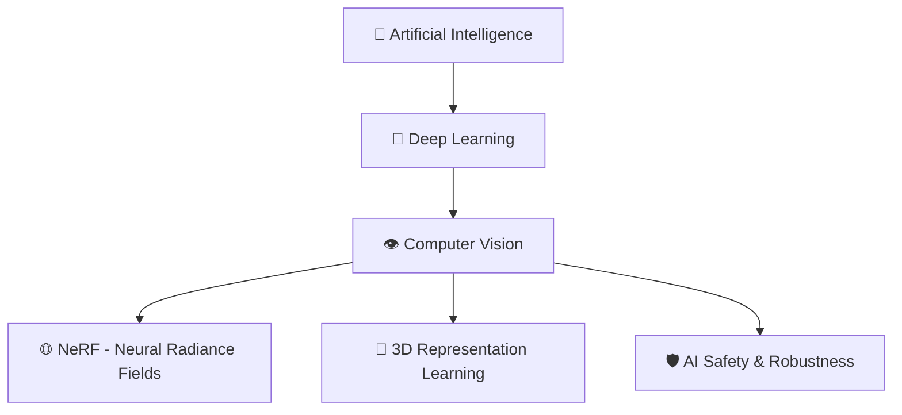

<div align="center">

# 🚀 Welcome to Deep Overflow's Universe


<div style="background: linear-gradient(135deg, #667eea 0%, #764ba2 100%); padding: 20px; border-radius: 15px; margin: 20px 0;">

### 👨‍🔬 Seongchan Kim | Deep Learning Researcher & Developer

</div>

[](mailto:2020320120@korea.ac.kr)
[](https://instagram.com/star._.overflow)
[](https://github.com/deep-overflow)


</div>

---

## 🎯 Mission Statement

<div align="center">

> ### 💡 "*Making the world safer from various risks through AI*"

*Bridging the gap between cutting-edge research and real-world safety applications*

</div>

## 🧪 Research Focus

<details>
<summary>🔬 <b>Click to explore my research interests</b></summary>

<br>



### 🎯 Current Research Areas:
- **🌐 Neural Radiance Fields (NeRF)**: Novel view synthesis and 3D scene understanding
- **📐 3D Representation Learning**: Developing robust 3D understanding models
- **👁️ Computer Vision**: Advanced visual perception systems
- **🛡️ AI Safety**: Building reliable and safe AI systems

</details>

## � Tech Arsenal & Skills

<div align="center">

### 🔥 Programming Languages


### 🧠 AI/ML Frameworks


### 🛠️ Tools & Platforms


### 📊 Skill Progress
<table>
<tr>
<td>

**🧠 Deep Learning**
```text
Advanced    ████████████████░░░░ 80%
```

**👁️ Computer Vision**
```text
Advanced    ████████████████░░░░ 85%
```

**🌐 NeRF/3D**
```text
Intermediate ████████████░░░░░░░░ 70%
```

</td>
<td>

**🐍 Python**
```text
Expert      ████████████████████ 95%
```

**⚡ C++**
```text
Advanced    ███████████████░░░░░ 75%
```

**🔧 MLOps**
```text
Intermediate ████████████░░░░░░░░ 65%
```

</td>
</tr>
</table>

</div>

## 📊 GitHub Analytics & Activity

<div align="center">

<table>
<tr>
<td width="50%">


</td>
<td width="50%">


</td>
</tr>
</table>


### 🏆 GitHub Trophies


</div>

## 🎓 Academic Journey & Experience

<div align="center">

### 🏛️ Current Positions

<table>
<tr>
<td width="33%" align="center">

**🎓 Student**  
*Computer Science & Engineering*  
Korea University  
*2020.03 ~ Present*

</td>
<td width="33%" align="center">

**🔬 Research Intern**  
*CVLAB*  
Korea University  
*2022.01 ~ Present*

</td>
<td width="33%" align="center">

**👑 Leader**  
*AIKU*  
Korea University  
*2022.08 ~ Present*

</td>
</tr>
</table>

### 📚 Past Experience

<details>
<summary>🏔️ <b>ALPS Board Member</b> (2020.09 ~ 2021.07)</summary>
<br>
<ul>
<li>Participated in academic board activities</li>
<li>Contributed to student community development</li>
</ul>
</details>

<details>
<summary>🧪 <b>Research Intern at IBEL LAB</b> (2020.12 ~ 2021.02)</summary>
<br>
<ul>
<li>Early research experience in laboratory environment</li>
<li>Gained foundational research skills</li>
</ul>
</details>

</div>

## 🔬 Research & Projects Showcase

<div align="center">

<table>
<tr>
<td width="50%">

### 🌐 NeRF Research
```diff
+ Novel View Synthesis
+ 3D Scene Understanding  
+ Real-time Rendering Optimization
```

*🔍 Exploring neural representations for 3D scenes*

</td>
<td width="50%">

### 📐 3D Representation Learning
```diff
+ Point Cloud Processing
+ Mesh Generation
+ Geometric Deep Learning
```

*🎯 Building robust 3D understanding models*

</td>
</tr>
</table>

<table>
<tr>
<td width="50%">

### 🛡️ AI Safety Projects
```diff
+ Adversarial Robustness
+ Model Interpretability
+ Safety-Critical Applications
```

*⚡ Ensuring AI systems are reliable and safe*

</td>
<td width="50%">

### 👁️ Computer Vision Applications
```diff
+ Medical Image Analysis
+ Autonomous Systems
+ Real-world Deployment
```

*🚀 Applying vision models to solve real problems*

</td>
</tr>
</table>

### 🎯 Featured Research Areas


</div>

---

## 🤝 Let's Connect & Collaborate!

<div align="center">

### 📬 Get In Touch

<table>
<tr>
<td width="25%" align="center">

**💼 Professional**  
[](https://linkedin.com/in/seongchan-kim)

</td>
<td width="25%" align="center">

**📧 Email**  
[](mailto:2020320120@korea.ac.kr)

</td>
<td width="25%" align="center">

**📸 Social**  
[](https://instagram.com/star._.overflow)

</td>
<td width="25%" align="center">

**🐙 GitHub**  
[](https://github.com/deep-overflow)

</td>
</tr>
</table>

### 🌟 Interested in Collaboration?

I'm always excited to discuss:
- 🔬 **Research collaborations** in Computer Vision & AI Safety
- 💡 **Open source projects** that make a difference  
- 🎓 **Academic partnerships** and knowledge sharing
- 🚀 **Industry applications** of cutting-edge AI research

<br>

---

<div align="center">

### 💫 "The future belongs to those who believe in the beauty of their dreams"

*Building tomorrow's AI, one algorithm at a time* ✨

<br>


**⭐ Star this repository if you found it interesting!**

<sub>🔄 Last updated: 2025년 9월 28일 | 💻 Made with ❤️ by Deep Overflow</sub>

</div>